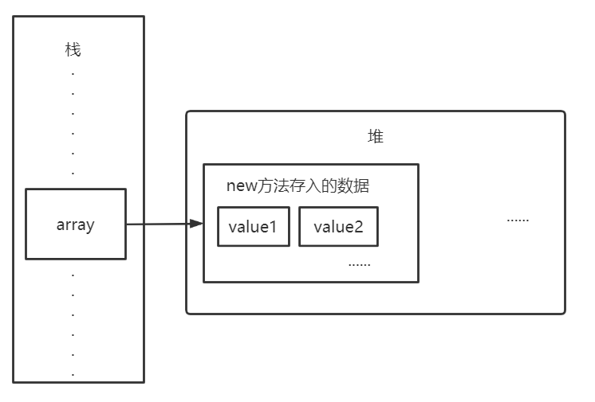

## Array

### 1.数组的定义

相同类型数据的有序结合，可以通过数组下标(**从0开始**)来访问数组中的某个元素。数组在Java中**存储在栈中**，数组大小一旦被确定则无法改变，在Java中定义一个数组通过以下代码：

```java
//Java风格
type[] arr_name = new type[size]; 

//C风格
type arr_name[] = new type[size];

//赋值
arr_name[index] = value;
type[] arr_name = {value1, value2, ...}
```

---

### 2.数组的内存分析

数组在声明时，存储在**JVM的栈中**，在对数组中的元素进行赋值时，这些值存储在堆中。示意图如下：



---

### 3.数组的使用

##### 3.1数组遍历及打印

```java
public static void printArray(int[] array){
    for (int index = 0; index < array.length; index++) {
        System.out.println(array[index]);
    }
}
```

##### 3.2数组反转

```java
public static int[] reverse(int[] array){
    int[] reverse = new int[array.length];
    for (int index = 0, j = array.length-1; index < array.length; index++, j--) {
        reverse[index] = array[j];
    }
    return reverse;
}
```

---

### 4.二维数组

```java
//二维数组定义
type[][] array = new int[row][colum]; 
//二维数组定义并赋值
type[][] array = {{value1,value2}, {value3,value4}, ...};
```

---

### 5. Arrays Class

Arrays类是Java.util.Arrays中的工具包，其包含数组操作中的各种方法，相关的文档如下：https://docs.oracle.com/javase/7/docs/api/ 在使用时仅需import java.util.Arrays即可。

```java
import java.util.Arrays;

Arrays.method(value);
```
