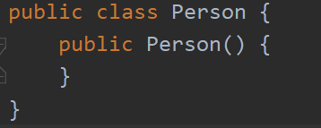
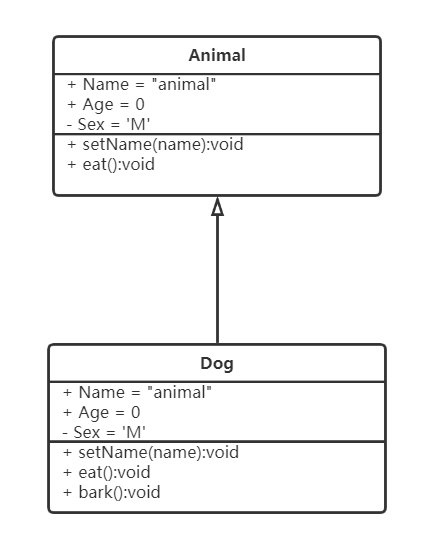
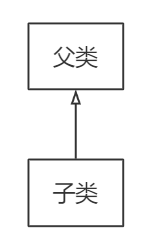

## OOP (Object-Oriented Programming)

### 1.面向对象定义

以类的方式组织代码，以object形式进行数据、方法的封装。在面向对象的实现中依然是面向过程的。在Java中面向对象是将对象抽象化，其三大特性为**封装、继承、多态**。

---

### 2.类结构

一个类中存在属性和方法，其具体结果如下：

```java
public class Person{
    //属性
    String name;
    int age;
    
    //方法
    public void eat(){
        /*code...*/
    }
}
```

---

### 3.创建对象

使用**new关键字**来创建对象，会分配相应的内存空间，并进行默认初始化及无参构造，以上述Person类为例

```java
//new一个Person对象
Person person = new Person();
//获得对象属性
System.out.println(person.name);
//调用对象方法
person.eat();
```

---

### 4.构造器、有参构造、无参构造

***构造器**：是一种与**类名相同**，且**没有包含void在内的任何返回类型**的一种方法。其在类对象实例化时必须调用。

以3.创建对象中的person类举例，当程序执行 **Person person = new Person();** 时，实际是在调用class Person中的构造器 **public Person(){ }**。下图为编译后的Person.class文件中的构造器Person(){}。



**无参构造**：指的是在不引入参数的情况下，修改Person中的代码内容，实例化对象的初始值。举例如下：

```java
public class Person {
    String name;
    //无参构造
    public Person(){
        this.name = "ABC";
    }
}

```

```java
public class test{
    public static void main(String[] args) {
        Person person = new Person();
        System.out.println(person.name);
    }
}

output： ABC
程序打印结果为无参构造时预先设定的name参数"ABC"
```

***有参构造**：有参构造指的是，在Person.java文件中重载Person()并预先定义Person中的属性值。**若使用有参构造，则在Person.java中务必存在无参构造的显式形式**，举例如下：

```java
public class Person {
    String name;
    //若存在有参构造，则无参构造必须显式表示
    public Person(){}
    //有参构造，重写Person，将调用时传入的参数作为对象的name
    public Person(String name){
        this.name = name;
    }
}
```

在存在无参构造时，当调用Person时，若传入参数，则会在初始化person实例时使用Person(String name)方法来构造对象。如下：

```java
public class test{
    public static void main(String[] args) {
        //使用有参构造初始化person
        Person person = new Person("ABC");
        System.out.println(person.name);
    }
}

output： ABC
程序打印结果为初始化时输入的参数"ABC"
```

---

### 5.封装

指的是在设计一个类时，类的内部属性禁止从外部访问，通过方法接口来访问，实现高内聚，低耦合的设计。通过封装，可以提高程序的安全性，保护数据，隐藏代码的细节，提高可维护性。在封装中一般对属性进行get和set的操作。以Person类为例子：

```java
public class Person{
    //使用private对name和age进行封装
    private String name;
    private String age;
    //通过方法来对name进行操作
    //get操作
    public String getName(){
        return name;
    }
    //set操作
    public void setName(String name){
        this.name = name;
    }
}
```

---

### 6.继承

指的是对某一批类的抽象，在Java中类**只有单继承没有多继承**，用关键字**extends**来实现，通过继承，子类可以拥有父类全部的属性和方法。**注：以private、final修饰的类无法继承**。以Animal、Dog类为例：

```java
public class Animal{
	//父类的三种属性
    public String Name = "animal";
	protected int Age = 0;
	private char Sex = 'M';
	
    //父类的方法
    public void setName(String name){
        this.name = name;
    }
    public void eat(){
    	/*code...*/
	}
}

public class Dog extends Animal{
	public void bark(){
        System.out.println("wf!");
    }
}

public class Test {
    public static void main(String[] args) {
        Dog dog = new Dog();
        System.out.println(dog.Name);
        System.out.println(dog.Age);
        dog.setName("Siri");
        System.out.println(dog.Name);
        dog.bark();
    }
}

output:
    animal	//子类继承父类public属性，Name在子类未做更改，故输出"anamial"
    0	//子类继承父类protected属性

    Siri //子类更改继承的父类属性，将名字从"animal"改为"Siri"
    wf!	//子类使用自定义方法
```

两个类之间的继承关系示意图如下，可见**子类可以继承父类全部的public和protected属性和方法**，**不能继承private的属性和方法**。同时**子类可以添加独有的属性和方法**。



---

### 7. Super关键字

super是一种应用在**子类中的关键字**，其目的是**调用父类的public/protected属性、方法以及构造方法**。下面将通过Animal类和Dog类进行说明。

##### 7.1 调用父类属性、方法举例

```java
Animal父类
public class Animal{
    //父类的属性
    public String name = "animal";

    //父类的方法
    public void eat(){
        System.out.println("Animal: Eat food!");
    }
}

Dog子类
public class Dog extends Animal{
    public String name = "dog";

    public void eat(){
        System.out.println("Dog: Eat meat!");
        super.eat();
    }

    public void showName(){
        System.out.println("I'm " + name);
        System.out.println("I'm " + this.name);
        System.out.println("I'm " + super.name);
    }
}

Test测试类
public class Test {
    public static void main(String[] args) {
        Dog dog = new Dog();
        dog.eat();
        dog.showName();
    }
}

output:
Dog: Eat meat！
Animal: Eat food!
I'm dog
I'm dog
I'm animal
```

从测试结果可见，使用super关键字可以访问父类中public/protected的属性和方法，在子类中使用this.name和name都是访问该类中的属性。

##### 7.2 Super与无参构造方法

在初始化子类时，调用构造方法时，即使未显示地显示super()关键字，代码也会自动执行父类的无参数构造后再执行子类的无参构造方法。

举例如下：

```java
public class Animal{
    //父类的无参构造方法
    public Animal(){
        System.out.println("animal: Parameterless construction");
    }
}

public class Dog extends Animal{
    //子类的无参构造方法
    public Dog() {
        System.out.println("dog: Parameterless construction");
    }
}

public class Test {
    public static void main(String[] args) {
        Dog dog = new Dog();
    }
}

output:
animal: Parameterless construction
dog: Parameterless construction
```

在输出中可见，先调用了父类的无参构造方法后调用了子类的无参构造方法，可见在子类无参构造代码中实质为：

```java
public class Dog extends Animal{
    //子类的无参构造方法
    public Dog() {
        //super()默认为非显示形式
        super();
        System.out.println("dog: Parameterless construction");
    }
}
```

---

### 8. 重写 (Override)

在**继承关系**中，子类中与父类某些**非私有非静态方法**完全一致的方法(**方法名、返回值、传入参数等均一致**)，方法体不同。在重写时修饰符的范围可以向上扩大不可缩小，抛出的异常可以被缩小但是不能被扩大。一般在重写方法前面会使用注解***@Override***。对于static、final、private方法不可以重写，因为这几种方法分别对应的为类中方法，常量区方法和私有方法，因此不可以 重写。

以Dog和Animal类举例：



在Java的继承关系中，方法的使用采用向下兼容模式，在创建对象时，父类的引用可以指向子类类型和父类类型，但是子类的引用仅可以指向子类类型，对于创建对象以及重写的举例如下。

```java
//父类
public class Animal{
    public void say(){
        System.out.println("I'm animal!");
    }
}

//子类
public class Dog extends Animal{
    @Override
    public void say() {
        System.out.println("I'm dog!");
    }
}

//测试类
public class Test {
    public static void main(String[] args) {
        Dog dog = new Dog();	//允许
        Animal animal = new Dog();	//允许
        Dog dog1 = new Animal(); 	//不允许
    }
}

//测试类1
public class Test1 {
    public static void main(String[] args) {
        Dog dog = new Dog();	//允许
        Animal animal = new Dog();	//允许
        dog.say();
        animal.say();
    }
}

output:
I'm dog!
I'm dog!
两个输出均为Dog类中的say()方法，这是因为在Dog类中重写了Animal中的say()方法，当在Test1中创建Animal类型的变量animal时，由于new的是Dog(),因此在执行animal.say()时，使用的为Dog类中重写的say()方法。

```

---

### 9. 多态

多态指的是在父子类继承，存在方法重 写的前提下。在调用同一方法时，根据引用的类型，动态地决定使用的具体方法。多态指的是对类中方法，对于类中的属性则无多态一说。**多态存在的三个条件：继承、重写、父类引用指向子类** 

```java
public class Animal{
    public void say(){
        System.out.println("I'm animal!");
    }
}

public class Dog extends Animal{
    @Override
    public void say() {
        System.out.println("I'm dog!");
    }

    public void bark(){
        System.out.println("Bark!");
    }
}

public class Test {
    public static void main(String[] args) {
        Dog dog = new Dog();
        Animal animal = new Animal();
        Animal animal1 = new Dog();
        
        dog.say();	//dog类型为Dog，调用say()方法使用的为Dog类中的方法
        animal.say();	//animal类型为Animal，调用say()方法使用的为Animal类中的方法
        animal1.say();	//animal1类型为Animal，引用为Dog,调用say()方法使用的为Dog类中重写的say()方法
        ((Dog)animal1).bark();	//animal1调用bark()方法时，使用的为子类中独有的方法，因此需要强制类型转换
        ((Dog)animal).bark();	//animal调用bark()方法报错，原因为animal引用为Animal，无法动态指向子类的方法
    }
}

output:
I'm dog!
I'm animal!
I'm dog!
Bark!
error
```

通过以上代码的执行结果发现，Java中对象在执行方法时是动态解析的，**在定义一个对象时，我们仅能确定对象的类型(等号左面)，不能确定对象执行方法时指向的具体方法**。

当父类对象引用子类时，若在子类中存在重写的方法，则执行子类中重写的方法，若父类对象执行子类中独有的方法时，则需要类型强制转换后执行。

---

### 10. static详解

Java中的static属性、static方法是**随着一个类的加载而加载，并且只加载一次**，static修饰的属性/方法放置在JVM中的静态区，其隶属于类。

##### 10.1 静态属性

以static修饰的属性为静态属性，其可以通过 **类名.属性** 直接进行访问。

```java
public class Animal{
    //静态属性
    static String name = "animal";
}

public class Test {
    public static void main(String[] args) {
        //直接通过类名.属性输出静态属性
        System.out.println(Animal.name);
    }
}

output:	animal
```

##### 10.2 静态方法

以static关键字修饰的方法称作静态方法。静态方法可以通过 **类名.方法名** 来调用。

```java
public class Animal{
    //静态方法
    static void say(){
        System.out.println("I'm animal!");
    }
}

public class Test {
    public static void main(String[] args) {
        Animal.say();
    }
}

output: I'm animal!s
```

##### 10.3 静态代码块、匿名代码块、构造器执行顺序

**静态代码块**指的是在类中出现的以下方格式出现的代码块。在加载时随着类加载且仅加载一次，在加载顺序上：静态代码块先于匿名代码块，匿名代码块先于构造器。

```java
public class Demo{
    static{
        /*code...*/
    }
}
```

**匿名代码块**指的是在类中出现的以下方格式出现的代码块。随着每次类加载而加载，常用于对象属性的初始化赋值。

```java
public class Demo{
    {
        /*code...*/
    }
}
```

**三种代码块执行顺序及次数测试**

```java
import javax.xml.crypto.dom.DOMCryptoContext;

public class Test{
    //构造器
    public Test() {
        System.out.println("I'm constructor!");
    }
    //静态代码块
    static {
        System.out.println("I'm static!");
    }
    //匿名代码块
    {
        System.out.println("I'm anonymous!");
    }

    public static void main(String[] args) {
        Test test = new Test();
        Test test1 = new Test();
    }
}

output:
I'm static!	//static代码块执行，仅执行了一次
I'm anonymous!	//匿名代码块执行
I'm constructor!	//构造器执行
I'm anonymous!	//匿名代码块再次执行
I'm constructor!	//构造器再次执行
```

---

### 11.抽象 (abstract)

在Java中抽象指的是对于类或方法的约束，用**abstract**关键字来修饰。根据abstract修饰的不同，分为抽象类和抽象方法。抽象类只能通过子类继承来实现，抽象方法只能通过子类中重写该方法实现。抽象类无法通过new关键字引用。抽象方法只能存在于抽象类中。抽象类中可以有非抽象方法。抽象类也存在构造器。在实际编码中，抽象主要用于系统架构的设计，框架的使用，其可以不受具体代码的拘束来进行整体架构的设计。具体用法如下：

```java
//抽象类
public abstract class Animal{
	//抽象方法
    public abstract eat(){
        /*coding*/
    }
}
```

---

### 12.接口 (Interface)

Java中使用**interface**关键字来实现接口，接口中仅有规范无法写方法，**接口支持多继承**。是对对象的抽象。一般接口都存在实现类，实现类以 接口名+Impl 命名。通过implements实现接口。

```java
public interface Service{
    //仅可定义方法，但无法写方法的具体实现
    public abstract void run(String name);
}

public class UserService implements Service{
    @Override
    public void run(String name){
        /*code... */
    }
}
```
