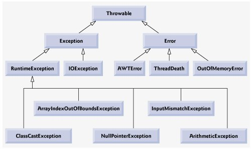

## Exception

### 1.异常定义

在Java中将异常当作对象来处理，在Java API中以 java.lang.Throwable 作为所有异常的超类。在Java中异常类主要分为Error和Exception。Error通常由JVM引起，编译时多半不可见，较为严重。Exception多半由编写代码者疏忽造成，有时编译可见。



---

### 2.异常的捕获

在Java中对于**异常的捕获**常使用关键字**try, catch, finally(可选)**组成的代码结构来进行处理。try代码块中为待执行程序，catch中写捕获的异常类型及相应动作，finally代码块中书写无论是否报错都将执行的代码。下面将以除数为0的异常进行说明。

```java
try{
    int a = 1;
    int b = 0;
    System.out.println(a/b);
}catch (ArithmeticException e){
    System.out.println(e);
}finally {
    System.out.println("finally");
}
```

---

### 3.异常的抛出

在Java中对异常的抛出指的是**在方法中**若出现异常且该方法无法解决，则为了程序正常运行，该方法会使用 **throws** 关键字来将异常抛出给调用其的方法，若调用其的方法仍无法解决则继续向上抛出。以除数为0为例：

```java
public class Test{
    public static void main(String[] args) {
        Test test = new Test();
        try {
            test.div(1,0);
        } catch (ArithmeticException e) {
            System.out.println(e);
        } finally {
            System.out.println("finally");
        }
    }
	
    //div方法在遇到除数为0时，会将异常抛给调用它的方法main，在main中通过异常捕捉解决
    public void div(int num1, int num2) throws ArithmeticException{
        System.out.println(num1/num2);
    }
}
```
