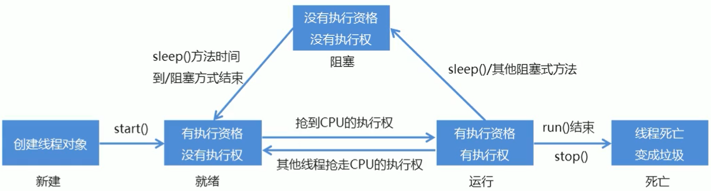
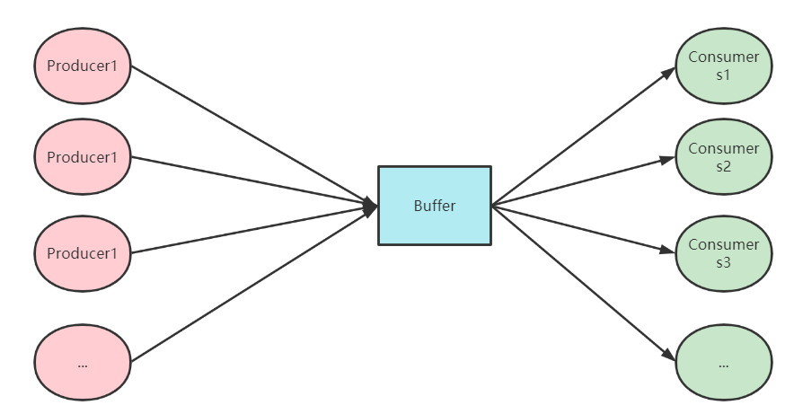

## CH8 Thread

### 01 进程、线程

进程(process): 指的是执行程序的独立过程，由操作系统分配，每一个进程都占有独有的内存空间以及系统资源。一个进程当中可以包含多个线程，至少有一个主线程。

线程(thread):线程是CPU调度和执行的单位。是进程中每一个单个顺序控制流。

线程生命周期：

---

### 02 线程创建

**Thread类创建线程**

首先将自定义类继承Thread类，重写run()方法，然后创建线程对象，调用start()方法启动线程（实质为使用JVM调用run()方法）。

```java
//自定义多线程类，继承Thread类
public class Demo extends Thread{
    //重写run()方法
    @Override
    public void run() {
    	/*code*/
        }
    }
}

//测试类
public class Test {
    public static void main(String[] args) {
        //创建多线程类对象，调用start()方法开启多线程
        Demo demo = new Demo();
        demo.start();
    }
}
```

**Runnable接口创建多线程（推荐）**

将自定义类声明实现Runnable接口，后重写run()方法。在实现多线程时，先创建自定义类对象，后将自定义对象传递给Thread()并调用start()方法。使用这种方法可以**避免单继承的局限性，同一对象可以被多个线程使用**

```java
//自定义多线程类，继承Runnable接口
public class Demo implements Runnable{
    @Override
    public void run() {
		/*code*/
    }
}

//测试类
public class Test{
    public static void main(String[] args) {
        //实例化自定义类
        Demo demo = new Demo();
        //将自定义类的对象传递到Thread中，并启动
        Thread thread = new Thread(demo);
        thread.start();
		/*code*/
    }
}
```

---

### 03 线程方法

##### 3.1 线程停止

Java中提供stop()和destory()方法来使线程停止，但由于JDK版本的更新，官方已经不再建议使用这两种JDK自带的方法。

在实际应用中，我们常使用**标志位法**来构造让线程停止的方法。原理为当标志位flag=true时，线程正常运行；当flag=false时线程停止。举例如下：

```java
public class Test implements Runnable {
    //flag为标志位，当flag==true时，执行code
    private boolean flag = true;
    
    @Override
    public void run() {
        while (flag){
            /*code*/
        }
    }

    public void stop(){
        this.flag = false;
    }
}

```

##### 3.2 线程休眠

在Java中使用**sleep()**方法来使当前线程阻塞，阻塞的单位为毫秒。在休眠时间到达后，线程进入就绪状态。在休眠状态的线程不会释放已经获得的锁。举例如下：

```java
Thread.sleep(100);
```

##### 3.3 线程礼让

线程礼让指的是让正在执行的某一线程暂停并转为就绪状态，同时CPU重新调度所有就绪状态的线程，因此礼让仅是各线程重新抢夺CPU资源，不一定礼让的结果是成功的。在Java中使用**yield()**方法来实现。举例如下：

```java
public class Test implements Runnable{
    @Override
    public void run() {
        System.out.println(Thread.currentThread().getName() + " start");
        Thread.yield();
        System.out.println(Thread.currentThread().getName() + " end");
    }

    public static void main(String[] args) {
        Test test = new Test();
        Thread a = new Thread(test,"a");
        Thread b = new Thread(test,"b");
        a.start();
        b.start();
    }
}

礼让成功的结果：
b start
a start
b end
a end
    
礼让不成功的结果：
a start
a end
b start
b end
```

##### 3.4 线程合并

线程合并指的是某一线程进行优先执行（线程插队），只有当插队的线程执行完成后，其他线程才可以执行，否则其他线程一直处在阻塞状态。在Java中使用**join()**方法来实现，举例如下：

```java
public class Test implements Runnable{
    @Override
    public void run() {
        for (int i = 0; i < 10; i++) {
            System.out.println(i + " thread join!");
        }
    }

    public static void main(String[] args) throws InterruptedException {
        Test test = new Test();
        Thread threadJoin = new Thread(test);

        for (int i = 0; i < 50; i++) {
            if (i == 10){
                threadJoin.start();
                threadJoin.join();
            }
            System.out.println(i + " normal thread!");
        }
	}
}

输出结果为：
0 normal thread!
1 normal thread!
2 normal thread!
3 normal thread!
4 normal thread!
5 normal thread!
6 normal thread!
7 normal thread!
8 normal thread!
9 normal thread!
0 thread join!
1 thread join!
2 thread join!
3 thread join!
4 thread join!
5 thread join!
6 thread join!
7 thread join!
8 thread join!
9 thread join!
10 normal thread!
11 normal thread!
12 normal thread!
13 normal thread!
14 normal thread!
15 normal thread!
16 normal thread!
17 normal thread!
18 normal thread!
19 normal thread!
20 normal thread!
21 normal thread!
22 normal thread!
23 normal thread!
24 normal thread!
25 normal thread!
26 normal thread!
27 normal thread!
28 normal thread!
29 normal thread!
30 normal thread!
31 normal thread!
32 normal thread!
33 normal thread!
34 normal thread!
35 normal thread!
36 normal thread!
37 normal thread!
38 normal thread!
39 normal thread!
40 normal thread!
41 normal thread!
42 normal thread!
43 normal thread!
44 normal thread!
45 normal thread!
46 normal thread!
47 normal thread!
48 normal thread!
49 normal thread!

可见线程进行了插队操作
```

##### 3.5 线程状态

线程存在5个状态，对应线程的生命周期。具体状态详情如下：

| 状态       | 说明                   |
| ---------- | ---------------------- |
| New        | 创建但尚未启动的线程   |
| Runnable   | 在JVM中执行的线程      |
| Blocked    | 被阻塞的线程           |
| Waitting   | 等待其他线程执行的线程 |
| Terminated | 已经退出的线程         |

##### 3.6 线程优先级

Java中提供getPriority()和setPriority(rank)来设置线程的优先级别，优先级别的范围为1-10，其中10为最先优先级。需要注意的是，优先级高仅仅代表先执行的概率相对大，并不代表每一次执行都会优先执行。主线程的默认等级为5。

##### 3.7 守护线程

Java中线程包含用户线程以及守护线程。通过setDaemin(boolean)来设置是否开启守护线程。当被守护的线程停止时，守护线程也随之停止。

---

### 04 线程同步

当多个线程同时操作一个对象时，即并发时，会出现被操作对象的内容冲突问题，因此需要一种等待机制来安排线程的执行顺序，即线程同步。Java中解决并发问题是通过队列+锁的机制来进行的。

锁机制的关键字为**synchronized**，该关键字可以使对象获得一个排他锁，此时该对象独占被操作对象的资源，其他线程只能等待该线程释放锁后方可操作。

**非安全问题**

以多人买票为例，当程序中存在多个线程同时抢有限票时，若忽略线程安全问题，则会导致出现某几个线程抢夺到同一张票或某一线程抢到越界票等情况，具体代码和运行结果如下：

```java
public class Ticket implements Runnable {
	
    private static int ticketNum = 10;

    @Override
    public void run() {
        while (true){
            try {
                Thread.sleep(100);
            } catch (InterruptedException e) {
                e.printStackTrace();
            }
            if (ticketNum <= 0) {
                break;
            }
            System.out.println(Thread.currentThread().getName() + ": get ticket " + ticketNum--);
        }
    }

    public static void main(String[] args) {
        Ticket ticket = new Ticket();
        Thread thread0 = new Thread(ticket, "thread0");
        Thread thread1 = new Thread(ticket, "thread1");
        Thread thread2 = new Thread(ticket, "thread2");
        thread0.start();
        thread1.start();
        thread2.start();
    }
}

结果为：
thread0: get ticket 10
thread1: get ticket 8
thread2: get ticket 9
thread0: get ticket 6
thread2: get ticket 7
thread1: get ticket 7
thread1: get ticket 5
thread0: get ticket 4
thread2: get ticket 5
thread1: get ticket 2
thread0: get ticket 1
thread2: get ticket 3
    
可见ticket7和ticket5被购买了两次，这显然是错误的！
```

**同步方法**

Java中可以使用同步方法来进行线程的同步，将**synchronized**关键字修饰在方法前即可实现，在运行时，加锁的对象为**this.object**。以买票举例如下：

```java
public class Ticket implements Runnable {

    private int ticketNum = 10;
    boolean flag = true;

    @Override
    public void run() {
        while (flag){
            try {
                buy();
            } catch (InterruptedException e) {
                e.printStackTrace();
            }
        }
    }

    public synchronized void buy() throws InterruptedException {
        if (ticketNum <=0 ){
            this.flag = false;
            return;
        }
        Thread.sleep(1000);
        System.out.println(Thread.currentThread().getName() + ": get ticket " + ticketNum--);
    }

    public static void main(String[] args) {
        Ticket ticket = new Ticket();
        Thread thread0 = new Thread(ticket, "thread0");
        Thread thread1 = new Thread(ticket, "thread1");
        Thread thread2 = new Thread(ticket, "thread2");
        thread0.start();
        thread1.start();
        thread2.start();
    }
}

结果为：
thread0: get ticket 10
thread1: get ticket 9
thread0: get ticket 8
thread0: get ticket 7
thread2: get ticket 6
thread0: get ticket 5
thread2: get ticket 4
thread0: get ticket 3
thread1: get ticket 2
thread0: get ticket 1
```

**同步块**

同步块以**synchronized (obj){ /*code*/}**形式书写，其中obj为要上锁的对象，括号内写操作该对象的相关代码。举例如下：

```java
public void buy() throws InterruptedException {
    synchronized (this){
        if (ticketNum <=0 ){
            this.flag = false;
            return;
        }
        Thread.sleep(1000);
        System.out.println(Thread.currentThread().getName() + ": get ticket " + ticketNum--);
    }
}   
```

其中this指的是buy方法的实例。

---

### 05 锁

Java也提供了显式同步锁机制，使用Lock来对共享资源进行加锁，用**ReentrantLock**类来实现。加锁通过**lock()**方法，解锁通过**unlock()**方法。在执行优先级上，Lock>同步代码块>同步方法。

```java
ReentrantLock lock = new ReentrantLock();
public void buy() throws InterruptedException {
    try {
        //对同步代码块上锁
        lock.lock();
        if (ticketNum <=0 ){
            this.flag = false;
            return;
        }
        Thread.sleep(1000);
        System.out.println(Thread.currentThread().getName() + ": get ticket " + ticketNum--);
    } catch (Exception e) {
        e.printStackTrace();
    } finally {
        //解锁
        lock.unlock();
    }
}
```

---

### 06 信号量


---

### 07 管程


---

### 08 几种重要问题

##### 8.1 生产者-消费者问题

生产者-消费者问题是一类带有缓冲区的经典同步通信问题。在该问题中**生产者**负责生产产品并将产品放入缓冲区，**消费者**负责将产品从缓冲区取出并消耗掉。当缓冲区满时，生产者无法将产品放入缓冲区，停止并通知消费者消费产品；当缓冲区空时，消费者无法从缓冲区取产品，消费者通知生产者将商品放入缓冲区中，图示如下：



```java
//wait() & notify() method
public class PCProblem {
    public static void main(String[] args) {
        Buffer buffer = new Buffer();
        Producers producers = new Producers(buffer);
        Consumers consumers = new Consumers(buffer);
        //start thread
        new Thread(producers, "p1").start();
        new Thread(consumers, "c1").start();
        new Thread(producers, "p2").start();
        new Thread(consumers, "c2").start();
        new Thread(producers, "p3").start();
        new Thread(consumers, "c3").start();
    }
}

class Producers implements Runnable{
    Buffer buffer = new Buffer();

    //constructor
    public Producers(Buffer buffer){
        this.buffer = buffer;
    }

    @Override
    public void run() {
        while (true) {
            try {
                buffer.product(buffer.goods);
            } catch (InterruptedException e) {
                e.printStackTrace();
            }
        }
    }
}

class Consumers implements Runnable{
    Buffer buffer = new Buffer();

    //constructor
    public Consumers(Buffer buffer){
        this.buffer = buffer;
    }

    @Override
    public void run() {
        while (true){
            try {
                Thread.sleep(1000);
                buffer.consume();
            } catch (InterruptedException e) {
                e.printStackTrace();
            }
        }
    }
}

class Buffer{
    //buffer property
    private int size = 10;
    private int count = 0;
    Goods[] goods = new Goods[size];

    //product goods and put them in buffer
    public synchronized void product(Goods[] goods) throws InterruptedException {
        //buffer full, producer wait
        if(count == goods.length){
            wait();
            notifyAll();
            return;
        }
        //buffer has room, producer product and put goods
        Goods newGood = new Goods(count);
        goods[count] = newGood;
        count++;
        System.out.println(Thread.currentThread().getName() + ": product good" + newGood.getId());
    }

    //consume goods and delete them
    public synchronized void consume() throws InterruptedException {
        //buffer empty, consumer wait
        if (count <= 0){
            notifyAll();
            wait();
            return;
        }
        //buffer has goods, consume and delete them
        System.out.println(Thread.currentThread().getName() + ": consume good" + goods[count-1].getId());
        goods[count-1] = null;
        count--;
    }
}

class Goods{
    private int id;

    public Goods(int id) {
        this.id = id;
    }

    public int getId() {
        return id;
    }
}

结果：
p1: product good0
p1: product good1
p1: product good2
p1: product good3
p1: product good4
p1: product good5
p1: product good6
p1: product good7
p1: product good8
p1: product good9
c3: consume good9
c2: consume good8
c1: consume good7
c1: consume good6
c2: consume good5
c3: consume good4
c3: consume good3
c2: consume good2
c1: consume good1
c1: consume good0
    ......
```


##### 8.2 哲学家就餐问题


##### 8.3 读者-写者问题


##### 8.4 理发师问题


##### 8.5 烟鬼问题


---

### 09 线程池
